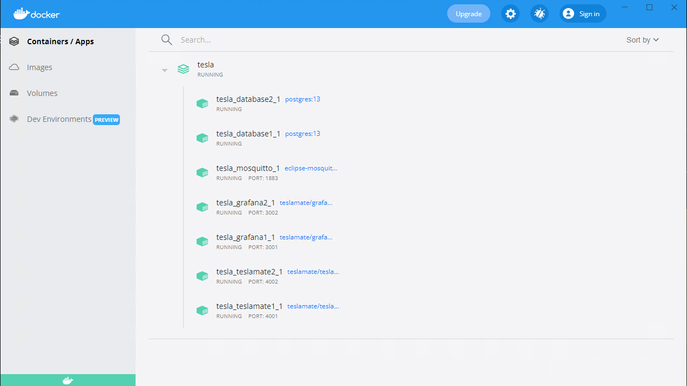

# Multiple Account TeslaMate




**Note: New version of teslamate already supported for multiple car in the same accounts. This approach only useful for different account/token**

Quick and Dirty Version for two accounts / instances of teslamate on same docker host.

### TLDR: 
If you start scratch, just use `docker-compose up -d` from `docker-compose.yml`


If you need to migrate from 1 instance setup to 2 accounts, try the following:
#### 1. Export and backup the existed instance
```
docker-compose exec -T database pg_dump -U teslamate teslamate > teslamate.bck
```
##### Check the running instance:
```
docker ps
CONTAINER ID   IMAGE                        COMMAND                  CREATED      STATUS      PORTS                    NAMES
4d5aad5c42ed   teslamate/teslamate:latest   "tini -- /bin/sh /en…"   3 days ago   Up 2 days   0.0.0.0:4000->4000/tcp   tesla_teslamate_1
f753edb95a3c   eclipse-mosquitto:2          "/docker-entrypoint.…"   3 days ago   Up 2 days   0.0.0.0:1883->1883/tcp   tesla_mosquitto_1
913e1d26353f   postgres:13                  "docker-entrypoint.s…"   3 days ago   Up 2 days   5432/tcp                 tesla_database_1
528e136aed22   teslamate/grafana:latest     "/run.sh"                3 days ago   Up 2 days   0.0.0.0:3000->3000/tcp   tesla_grafana_1
```
#### Remove the current instance:
```
docker rm -f 4d5aad5c42ed f753edb95a3c 913e1d26353f 528e136aed22
```
#### Create new docker-compose.yml from this repo

[docker-compose.yml](docker-compose.yml)

#### docker up
```
docker-compose up -d
```
#### Restore saved db -- using official instruction
https://docs.teslamate.org/docs/maintenance/backup_restore
```
Replace `database` with `database1`

//Restore
docker-compose exec -T database1 psql -U teslamate -d teslamate < teslamate.bck
docker-compose start teslamate

```
### Done!
[localhost:4001](http://localhost:4001) - grafana account1

[localhost:4002](http://localhost:4002) - grafana account2

[localhost:3001](http://localhost:3001) - main account 1 login

[localhost:3002](http://localhost:3002) - main account 2 login
